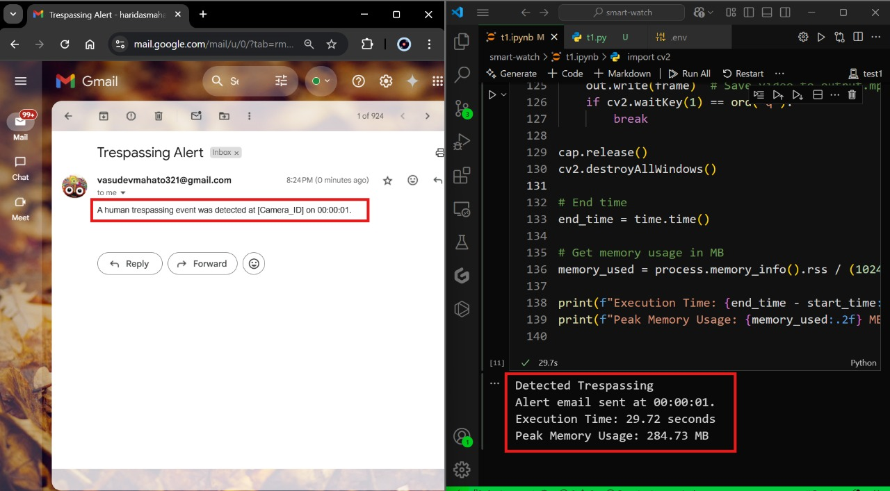
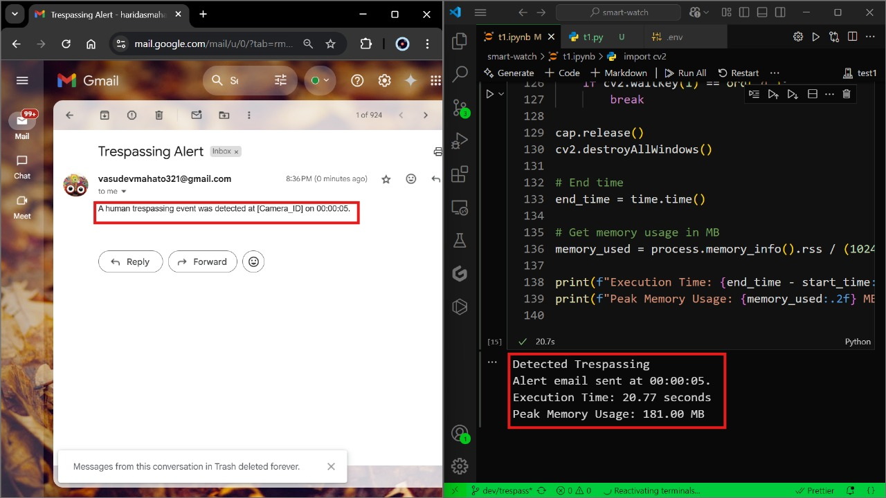

# Trespassing Detection System

## Overview

This project implements a real-time trespassing detection system using OpenCV, YOLOv8, and motion detection. It analyzes video frames for motion and then applies YOLOv8 object detection to identify humans. If a human trespasser is detected, an alert email is sent.

## Components Used

- **OpenCV**: For video processing and motion detection
- **YOLOv8 (Nano)**: Lightweight deep-learning model for object detection
- **SMTP**: Used for sending email alerts

## Process Flow

1. **Video Capture**: The system reads frames from the video feed.

2. **Motion Detection**:
   - A background subtractor detects motion.
   - If motion is detected, the system starts analyzing frames with YOLOv8.
3. **YOLOv8 Human Detection**:
   - The model processes frames to identify humans.
   - We are skipping a few frames to reduce the delay in human detection caused by YOLOv8.
   - Detects human in the frame for next 5 seconds.
   - If a human is detected with confidence ≥ 50%, a red bounding box is drawn.
4. **Email Alerts**:
   - If a human is detected and the predefined waiting period, which prevents multiple consecutive alerts in a short time, has elapsed, an email is sent.

Test 1 (Video Provided) 

Test 2 (Our Video)

## Key Features

- **Efficient Motion Detection**: Reduces unnecessary YOLOv8 computations.
- **Email Notifications**: Sends alerts when trespassing is detected.

## Resource Requirements

- **Memory Usage**: The system requires approximately **200-300** MB of memory for smooth operation.

## Conclusion

This project successfully detects human trespassing and sends alerts, making it useful for security applications. It balances efficiency with accuracy by combining motion detection and deep learning.

